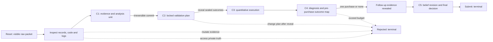

# UC-Bench v0.7 vertical environment specification

Status: **ready for one immutable freeze and bounded development execution; still scientifically unexposed**. v0.6.3 remains a frozen no-go and is not rescored. The v0.7 runner exists and has passed local payload, dependency, repository, and Docker gates. No held-out case or Astra configuration exists.

## Construct

The agent is a technical diligence team deciding whether to advance, pause, or stop investment in a locked baseline-biopsy transcriptomic predictor of week-6 clinical response to first infliximab in adults with moderate-to-severe ulcerative colitis.

This is an investigation. The agent must determine what evidence is eligible, reconstruct patients and outcomes, independently calculate performance and uncertainty, diagnose competing explanations, lock a validation plan, purchase one decision-relevant follow-up under budget, revise its beliefs, and bound the final claim. Correctly concluding that the evidence is inadequate is success.

Difficulty comes from interacting evidence—not file count, literature recall, exact wording, schema conformance, or completion pressure.

## Environment state machine

The environment records every action, file read, commitment digest, reveal, resource cost, and terminal state. Outcomes cannot be revealed without C1 and a committed C2. C2 cannot be changed after reveal. At most one resource action is allowed. Starting evidence is hash-protected.

## Start state

Each of the four packets contains 15 purposeful files:

- cohort metadata with sample, reported-patient, fingerprint, biopsy, visit, site, batch, platform, and eligibility fields;
- locked sample predictions and a small expression-derived feature summary;
- a blinded endpoint-source ledger with timing and review status;
- preprocessing code, declared configuration, and actual fit membership;
- execution timestamps;
- model manifest and reproduction cases;
- intended-use and validation manifests;
- sponsor assertions;
- one neutral resource catalogue.

The public packet never contains `leakage_status`, `identity_blocked`, `optimal_resource`, `scenario_class`, `expected_decision`, planted truth, or a preferred resource. Private outcomes and follow-up returns are outside the copied agent workspace until the corresponding action.

## Four cases

| Case | Professional decision | Interacting evidence | Harmless anomaly | Follow-up logic | Supported final range |
|---|---|---|---|---|---|
| 1. Clean but suspicious | Is the evidence good enough to advance without buying reassurance? | Valid patient-level performance plus incomplete execution detail | Duplicate assay export and noncausal clock skew | `none` and cheap pipeline confirmation are both acceptable | Conditional advance |
| 2. Dependence and site | Does strong naive performance survive the actual patient/site structure? | Repeated biopsies, duplicate reported ID, outcome-associated site mix, minor endpoint disagreement | Small endpoint-review disagreement | Source-record reconciliation resolves identity and leaves a site blocker | Pause or insufficient evidence |
| 3. Pipeline fit scope | Is the apparent performance eligible, and what happens after clean replay? | Validation membership, outcome-import timing, strong contaminated metrics, batch alias | One batch-name alias | Pipeline package returns outcome-blind replay | Stop if signal collapses; conditional advance if it remains |
| 4. Ranking without utility | Does attractive AUC support the proposed threshold use? | High AUC, poor Brier/calibration, negative net benefit, site variation | Two missing noncritical covariates | Matched external evidence directly tests the intended threshold | Pause or stop |

Case 3 has one identical starting packet and two separately sealed controlled returns. This prevents “leakage detected, therefore stop” from succeeding universally and isolates belief revision from leakage detection.

Complete adjudication cards, including the private truth, evidence path, calculations, alternatives, shortcuts, consequences, and final ranges, are in `artifacts/diagnostics/hard_suite_v07_case_validity_cards.json`.

## Five-checkpoint scoring contract

| Checkpoint | Weight | Consequential properties |
|---|---:|---|
| C1 — Evidence and analysis unit | 15% | Correct patient/sample structure, timing, dependence, site inspection, materiality, and traceable evidence |
| C2 — Locked validation plan | 20% | Pre-reveal commitment, correct analysis unit and fit scope, valid uncertainty, joint metrics, decision rule, competing explanations |
| C3 — Quantitative execution | 25% | Reproduced patient-level numbers, dependence/site handling, plan fidelity, contamination containment, joint discrimination/calibration/utility interpretation |
| C4 — Diagnosis and follow-up | 20% | Evidence-supported diagnosis, live alternatives, result-contingent plan, decision value, limitations, cost and budget |
| C5 — Belief revision and decision | 20% | Analysis of returned evidence, correct belief direction, supported initial/final action, bounded claims, residual uncertainty |

Property deductions record observed value, accepted target or range, professional consequence, and actionable remedy. Routine hashing, file enumeration, and JSON completion receive no scientific points. Data-free work is capped at 15 because it cannot support a diligence conclusion.

Numeric results are accepted within declared tolerances. Patient-cluster bootstrap, site-stratified bootstrap, cluster-robust, DeLong at the patient level, and defensible hierarchical uncertainty are accepted. Calibration curves/intercept-slope and expected calibration error are valid alternatives. Net benefit and explicit expected utility are valid alternatives under the same intended-use contract.

Nested or flat results, annotated labels, alternative file organization, explicit unresolved values, and resources within 0.08 decision-value units of the optimum are accepted. Exact prose is not scored.

## Full-mission success

Work quality is a 0–100 weighted partial-credit score. Full-mission success is a separate Boolean requiring all of the following:

- commitment preceded reveal and remained immutable;
- decision-relevant analysis was valid;
- contaminated evidence did not support the decision;
- the resource action was decision-efficient and within budget;
- belief changed in the correct direction after the returned evidence;
- the final investment action was supported;
- prohibited causal, clinical-utility, or broad-transport claims were not made.

A wrong final decision fails the mission but does not erase earlier work. An unsubmitted attempt retains its diagnostic work-quality score and receives zero reliability.

## Follow-up catalogue

The public catalogue uses neutral IDs and says only what records are returned, cost, delay, and what cannot be answered:

- `X17`: source-record reconciliation;
- `X24`: endpoint evidence;
- `X31`: pipeline execution;
- `X46`: matched external evidence;
- `X58`: larger same-process sample;
- `X63`: expert review of existing files;
- `none`: no purchase.

Before purchase, C4 must specify how at least two possible returns would change beliefs or action. This makes resource selection a decision problem rather than diagnosis-name matching.

## Failure-to-remedy and paired interventions

Every planted failure maps to an observable error, exact scoring property, smallest next action, intervention category, and paired test. The implemented design covers:

- patient/site statistical helper for dependence handling;
- pipeline execution evidence for fit-scope leakage;
- the paired collapse/survive replay for belief revision;
- matched external data for calibration and threshold utility;
- a value-of-information aid for unnecessary reassurance;
- a claim-to-evidence checklist for overstatement.

These are hypotheses, not training-cause claims. A remedy is demonstrated only if paired model attempts recover at the predicted checkpoint without unrelated prompt changes. Details are in `hard_suite_v07_failure_remedy_map.json` and `hard_suite_v07_intervention_design.json`.

## Local construct controls

All zero-cost gates currently pass:

- two different valid solutions score 100 on every case and both Case 3 returns;
- nested results and prose changes do not alter scores;
- empty, sophisticated generic, and keyword submissions score at most 15;
- universal advance, pause, stop, and abstain policies cannot pass all missions;
- buying every resource fails the value/budget checkpoint and mission;
- one ordinary early analysis-unit error retains 94 work-quality points and full later checkpoint credit;
- start-state tampering, hidden access, and post-reveal plan changes are rejected;
- changing the Case 3 replay mechanism changes the correct decision and causes the unchanged submission to fail;
- every required result is recoverable after the authorized evidence action;
- the reference solver completes in at most 18 tool actions, below the 80-action limit.

Ten additional dependency invariants pass before freeze: correct labels cannot
rescue contaminated or unsupported analysis; plan-violating calculations and
wrong patient/site units retain partial credit but cannot validate; resources
are isolated; only precommit errors can be corrected; the two Case 3 returns
require different conclusions; final claims are bounded by the weakest
decision-critical evidence; both valid Case 1 resource policies pass; guessed
labels receive partial credit only; and missing submission changes reliability,
not the scientific-work diagnostic.

The builder-authored computational-biology and RL-environment reviews both pass their required checklists. They are internal construct engineering, not independent expert validation.

## Predicted calibration profile

This is a pre-exposure hypothesis, not a result:

- Case 1 should be easiest but can expose overreaction and unnecessary spend.
- Case 2 should separate agents that calculate patient/site effects from those that merely mention clustering.
- Case 3 should be hardest because success requires provenance reasoning, contamination containment, a correct purchase, new calculations, and mechanism-sensitive belief revision.
- Case 4 should expose AUC-centric reasoning and poor value-of-information selection.

Expected failure types span data structure, statistical validity, pipeline provenance, calibration/utility, experimental design, belief revision, and claim scope. No score target is manufactured by stricter wording or grader conventions. Actual difficulty remains unknown until paid trajectories exist.

## Authorized ten-episode calibration

Execution is allowed only after all local gates and the one-time freeze pass:

- ceiling proxy: `openai/gpt-5.6-sol`;
- frozen mid-level comparator: `openai/gpt-5.2`;
- five conditions: Cases 1, 2, and 4 plus both sealed Case 3 replay returns;
- Case 3 presents exactly the same visible packet in both conditions;
- one attempt per cell, ten episodes total;
- no Claude, Gemini, Kimi, held-out case, or Astra;
- no retry, second calibration round, or task/grader change after exposure.

Sol runs first and must average 55–75, pass exactly 2–3/5 missions, pass the easier Case 1, fail at least one harder condition, retain meaningful partial credit, and show at least three consequential scientific failures. A mean above 75 or 4–5 missions is a ceiling no-go; below 45 or 0–1 missions is a floor no-go. GPT-5.2 runs only after the Sol gate is inspected and passed. The two-model result must avoid universal failure, differ on a meaningful mission or capability, retain partial credit, keep each checkpoint at or below 30% of the model gap, and exclude schema/infrastructure from science.

Projected spend from the two matching v0.6.3 trajectories per model and recorded route prices:

- cached expected total: $7.28;
- cached P90: $9.19;
- reconstructed no-cache median: $33.19;
- reconstructed no-cache P90: $44.15;
- immutable hard cap: **$45.00**;
- authenticated key-limit headroom: $74.34471128; required top-up and key-limit increase: $0;
- sequential duration: approximately 1.5–3 hours.

The no-cache estimate reconstructs spend from cumulative input/output tokens at $2/$10 per million for Sol and $1.75/$14 per million for GPT-5.2, then applies 1.20 median and 1.35 P90 workload factors. The exact cost plan is machine-readable in `artifacts/diagnostics/hard_suite_v07_cost_plan.json`.

## Claims boundary

After one calibration seed, it would be defensible to say only that the five controlled conditions produced particular work-quality, mission, failure, recovery, and cost observations under the frozen protocol. It would not support a stable model ranking, real-world failure prevalence, biomarker efficacy, commercial validity, or claims that SFT, RL, prompting, retrieval, expert advice, or missing training data caused the behavior.

Repeated seeds are required for ranking and uncertainty. Paired interventions are required for remedy claims. Independent computational-biology review is required before strong public or commercial construct-validity claims. Authentic GEO evidence remains separately reported and cannot be pooled with controlled-case scores.
